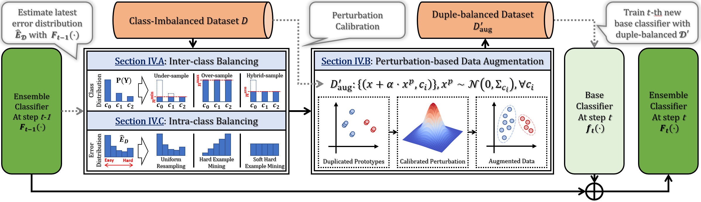

<h1 align="center"> DuBE: Duple-balanced Ensemble Learning from Skewed Data</h1>

<p align="center">
  
  
  =3.8.0-blue">
  
  
  
  
</p>

<h3 align="center"> 
<!-- "Towards Inter-class and Intra-class Imbalance in Class-imbalanced Learning" <br>  -->
(In Submission)
[<a href="https://duplebalance.readthedocs.io/">Documentation</a>]
[<a href="https://duplebalance.readthedocs.io/en/latest/auto_examples/index.html">Examples</a>]
</h3> 

**DuBE is an *ensemble learning framework* for (multi)class-imbalanced classification. It is an easy-to-use solution to imbalanced learning problems, features good performance, computing efficiency, and wide compatibility with different learning models.**
**Documentation and examples are available at https://duplebalance.readthedocs.io.**  

# Table of Contents

- [Table of Contents](#table-of-contents)
- [Background](#background)
- [Install](#install)
- [Usage](#usage)
- [Documentation](#documentation)

# Background

Imbalanced Learning (IL) is an important problem that widely exists in data mining applications. Typical IL methods utilize intuitive class-wise resampling or reweighting to directly balance the training set. However, some recent research efforts in specific domains show that class-imbalanced learning can be achieved without class-wise manipulation. This prompts us to think about the relationship between the two different IL strategies and the nature of the class imbalance. Fundamentally, they correspond to two essential imbalances that exist in IL: *the difference in quantity between examples from different classes* as well as *between easy and hard examples within a single class*, i.e., **inter-class** and **intra-class imbalance**. 


Existing works fail to explicitly take both imbalances into account and thus suffer from suboptimal performance. In light of this, we present Duple-Balanced Ensemble, namely DUBE, a versatile ensemble learning framework. Unlike prevailing methods, DUBE directly performs inter-class and intra-class balancing without relying on heavy distance-based computation, which allows it to achieve competitive performance while being computationally efficient. 



# Install

Our DuBE implementation requires following dependencies:
- [python](https://www.python.org/) (>=3.8.5)
- [numpy](https://numpy.org/) (>=1.19.2)
- [pandas](https://numpy.org/) (>=1.1.3)
- [scikit-learn](https://scikit-learn.org/stable/) (>=0.23.2)

You can install DuBE by clone this repository:

```Shell
git clone https://github.com/AnonAuthorAI/duplebalance.git
cd duplebalance
pip install .
```

# Usage

**For more detailed usage example, please see [Examples](https://duplebalance.readthedocs.io/en/latest/auto_examples/index.html).**

A minimal working example:

```python
# load dataset & prepare environment
from duplebalance import DupleBalanceClassifier
from sklearn.datasets import make_classification

X, y = make_classification(n_samples=1000, n_classes=3,
                           n_informative=4, weights=[0.2, 0.3, 0.5],
                           random_state=0)

# ensemble training
clf = DupleBalanceClassifier(
    n_estimators=10,
    random_state=42,
    ).fit(X_train, y_train)

# predict
y_pred_test = clf.predict_proba(X_test)
```

# Documentation

**For more detailed API references, please see [API reference](https://duplebalance.readthedocs.io/en/latest/api/_autosummary/duplebalance.DupleBalanceClassifier.html).**

**Our DupleBalance implementation can be used much in the same way as the ensemble classifiers in [sklearn.ensemble](https://scikit-learn.org/stable/modules/classes.html#module-sklearn.ensemble).** The `DupleBalanceClassifier` class inherits from the `sklearn.ensemble.BaseEnsemble` base class. 

Main parameters are listed below:

| Parameters    | Description   |
| ------------- | ------------- |
| `base_estimator` | *object, optional (default=`sklearn.tree.DecisionTreeClassifier()`)* <br> The base estimator to fit on self-paced under-sampled subsets of the dataset. NO need to support sample weighting. Built-in `fit()`, `predict()`, `predict_proba()` methods are required. |
| `n_estimators`    | *int, optional (default=10)* <br> The number of base estimators in the ensemble. |
| `resampling_target`  | *{'hybrid', 'under', 'over', 'raw'}, default="hybrid"* <br> Determine the number of instances to be sampled from each class (inter-class balancing). <br> - If ``under``, perform under-sampling. The class containing the fewest samples is considered the minority class :math:`c_{min}`. All other classes are then under-sampled until they are of the same size as :math:`c_{min}`. <br> - If ``over``, perform over-sampling. The class containing the argest number of  samples is considered the majority class :math:`c_{maj}`. All other classes are then over-sampled until they are of the same size as :math:`c_{maj}`. <br> - If ``hybrid``, perform hybrid-sampling. All classes are under/over-sampled to the average number of instances from each class. <br> - If ``raw``, keep the original size of all classes when resampling.|
| `resampling_strategy`  | *{'hem', 'shem', 'uniform'}, default="shem")* <br> Decide how to assign resampling probabilities to instances during ensemble training (intra-class balancing). <br> - If ``hem``, perform hard-example mining. Assign probability with respect to instance's latest prediction error. <br> - If ``shem``, perform soft hard-example mining. Assign probability by inversing the classification error density. <br> - If ``uniform``, assign uniform probability, i.e., random resampling. |
| `perturb_alpha`  | *float or str, optional (default='auto')* <br> The multiplier of the calibrated Gaussian noise that was add on the sampled data. It determines the intensity of the perturbation-based augmentation. If `'auto'`, perturb_alpha will be automatically tuned using a subset of the given training data. |
| `k_bins`         | *int, optional (default=5)* <br> The number of error bins that were used to approximate error distribution. It is recommended to set it to 5. One can try a larger value when the smallest class in the data set has a sufficient number (say, > 1000) of samples. |
| `estimator_params`         | *list of str, optional (default=tuple())* <br> The list of attributes to use as parameters when instantiating a new base estimator. If none are given, default parameters are used. |
| `n_jobs`         | *int, optional (default=None)* <br> The number of jobs to run in parallel for :meth:`predict`. ``None`` means 1 unless in a :obj:`joblib.parallel_backend` context. ``-1`` means using all processors. See :term:`Glossary <n_jobs>` for more details. |
| `random_state`   | *int / RandomState instance / None, optional (default=None)* <br> If integer, random_state is the seed used by the random number generator; If RandomState instance, random_state is the random number generator; If None, the random number generator is the RandomState instance used by `numpy.random`. |
| `verbose`         | *int, optional (default=0)* <br> Controls the verbosity when fitting and predicting. |
