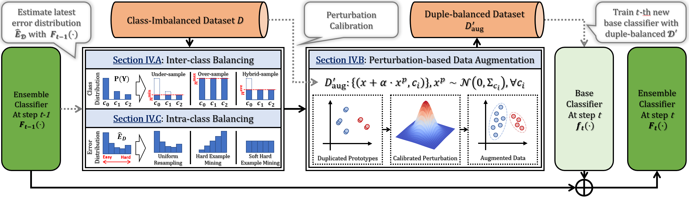

.. duplebalance documentation master file, created by
   sphinx-quickstart on Mon May 17 16:20:59 2021.
   You can adapt this file completely to your liking, but it should at least
   contain the root `toctree` directive.

Welcome to duplebalance documentation!
===============================================

**Date**: |today| **Version**: |version|

*duplebalance* is an open source, MIT-licensed Python software for 
(multi-)class ensemble imbalanced learning. This package implements 
`DuBE`, an general and efficient ensemble learning framework.
`DuBE` handles the class-imbalance by duple-balancing, i.e.,
perform inter-class and intra-class balancing simultaneously.

.. raw:: html

   

   
   
   =3.8.0-blue">
   
   
   
   
   

.. raw:: html

   <h3>
      [<a href="https://github.com/AnonAuthorAI/duplebalance">Github</a>]
      [<a href="https://duplebalance.readthedocs.io/en/latest/">Documentation</a>]
      [<a href="https://duplebalance.readthedocs.io/en/latest/auto_examples/index.html">Examples</a>]
   </h3>

.. toctree::
   :maxdepth: 3
   :caption: Getting Started

   get_start
   install

.. toctree::
   :maxdepth: 2
   :caption: API

   api/all_api

.. toctree::
   :maxdepth: 3
   :caption: Examples

   auto_examples/index

.. toctree::
   :maxdepth: 3
   :caption: History

   release_history
